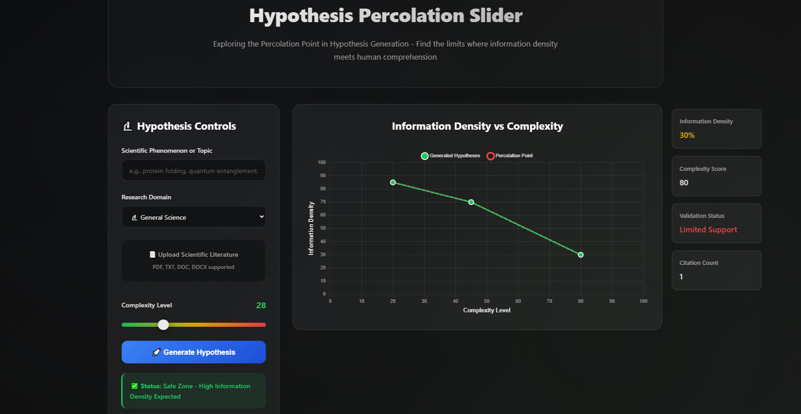

# percolation-hypotheses-gen
This project aims to develop a hypothesis generation engine that explores the relationship between hypothesis complexity and information density, specifically focusing on identifying the "percolation point"—the theoretical limit of human comprehension where information density sharply declines despite increasing complexity.

## Website (Alpha version)


## Overview
- There exists a correlation between the complexity of a hypothesis and its information density, up to a certain point. This point, the percolation point, represents the limit of human comprehension. Beyond this point, while complex hypotheses can still be generated (by LLMs), their information density plummets, leading to potentially misleading or nonsensical outputs (hallucination) that mimic scientific plausibility but lack grounding in reality. This project aims to visually and computationally demonstrate this concept.


## Hypothesis Generation

# Information Density Analysis

## Problem Statement

Measuring the *information density* of scientific hypotheses poses a fundamental challenge: the concept is inherently qualitative and multidimensional, yet computational approaches often attempt to reduce it to a single quantitative score. Traditional methods typically rely on either citation counts and semantic similarity—overlooking linguistic complexity and novelty—or focus solely on information-theoretic metrics like entropy and perplexity, ignoring scientific rigor and testability. This creates a false dichotomy between computational sophistication and scientific validity. A hypothesis may be linguistically complex and novel, yet scientifically unfalsifiable; or it may be rigorous and testable, yet predictable and low in informational value.

## Dual-Framework Evaluation

This project introduces a combined evaluation framework that addresses information density from two complementary perspectives: **information-theoretic analysis** and **scientific quality assessment**. The information-theoretic component quantifies linguistic complexity, domain novelty, and communication efficiency using entropy, surprisal, and perplexity relative to domain-specific corpora. The scientific quality component assesses falsifiability, specificity, empirical grounding, and predictive content, drawing from established principles in the philosophy of science.

The resulting scores are integrated using configurable weighting schemes tailored to different contexts—such as research discovery (emphasizing novelty), grant evaluation (emphasizing rigor), or educational use (balanced assessment). Outputs are presented as interpretable multidimensional scores rather than a single opaque number, enabling precise identification of areas needing improvement, whether in linguistic expression, scientific depth, or both.


```
percolation-hypotheses-gen
├─ .python-version
├─ docs
│  ├─ architecture.md
│  ├─ project_plan.md
│  └─ user_guide.md
├─ Frontend
│  ├─ index.html
│  ├─ main.js
│  └─ style.css
├─ LICENSE
├─ log
├─ misc
│  └─ demo.png
├─ pyproject.toml
├─ README.md
├─ requirements.txt
├─ sample_pdfs
│  ├─ 1706.03762v7.pdf
│  ├─ 2505.09053v1.pdf
│  ├─ 2505.09151v1.pdf
│  └─ 2505.11309v1.pdf
└─ src
   ├─ agents
   │  ├─ agent.py
   │  ├─ sub_agents.py
   │  └─ __init__.py
   ├─ config
   │  ├─ config.py
   │  └─ __init__.py
   ├─ Hypothesis_Analysis
   │  ├─ complexity_score.py
   │  ├─ information_density.py
   │  └─ information_density_.py
   ├─ literature_processing
   │  ├─ process_literature.py
   │  └─ __init__.py
   ├─ main.py
   ├─ models
   │  ├─ model.py
   │  └─ __init__.py
   ├─ server.py
   └─ __init__.py

```